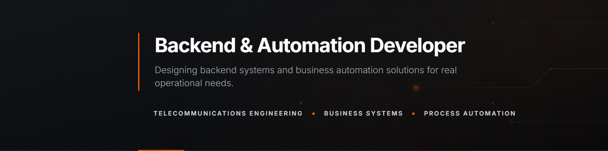

# Arisnel Montagne

## About

Backend & Automation Developer with a background in Telecommunications Engineering and hands-on experience in live network infrastructure and operational communication systems.

My technical interests are focused on backend development, systems design, business logic and process automation. I enjoy building structured solutions for real operational problems, with emphasis on scalability, modular architecture and system-oriented thinking.

Currently focused on improving my backend engineering skills through technologies such as Node.js, PostgreSQL, Prisma, TypeScript and NestJS, while evolving real-world automation systems toward modern web-based architectures.

## Main Project — Gestión Plus

Gestión Plus is a modular business operations and automation platform designed for small business management and workflow optimization.

Originally developed with Excel VBA, the system integrates multiple operational areas into a unified automation-driven environment focused on real-world business processes.

### Core Modules

- Inventory Management
- POS & Billing
- Financial Tracking
- Sales Analytics
- Workforce Management
- Recipe & Ingredient Control
- Production Automation
- Operational Dashboards

### Engineering Focus

- modular architecture
- integrated business workflows
- process automation
- operational logic modeling
- cross-module system integration
- automation-oriented UX

### Current Evolution

Currently evolving Gestión Plus toward a scalable backend/web SaaS architecture using modern backend technologies

## Technical Focus

Backend development and operational systems built with:

  
  
  
  
  

Currently expanding into:

  
  

## Engineering Interests

Interested in backend systems, operational software and automation-driven architectures focused on real business workflows, scalability and process optimization.

## Contact

